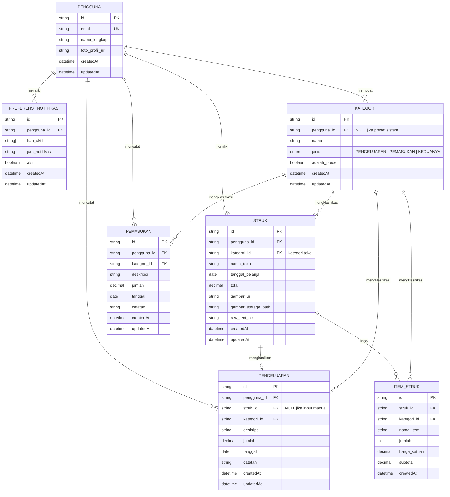
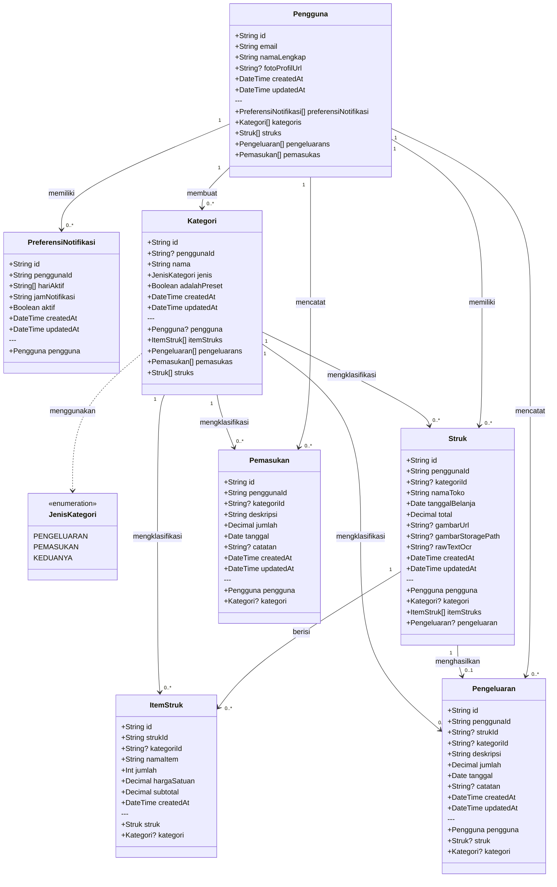

# Rancangan Class Diagram — Snap Notes

Dokumen ini berisi rancangan class/model untuk aplikasi Snap Notes, mencakup entitas database (Prisma schema), hubungan antar entitas, dan struktur modul NestJS.

---

## 1. Entity Relationship Diagram (ERD)



---

## 2. Class Diagram — Model & Relasi



---

## 3. Class Diagram — Modul NestJS (Service & Controller)

```mermaid
classDiagram
    class AuthController {
        +daftar(dto: DaftarDto) Promise~AuthResponseDto~
        +masuk(dto: MasukDto) Promise~AuthResponseDto~
        +keluar(req: Request) Promise~void~
        +refresh(dto: RefreshDto) Promise~AuthResponseDto~
        +getProfil(req: Request) Promise~ProfilDto~
        +updateProfil(req: Request, dto: UpdateProfilDto) Promise~ProfilDto~
    }

    class AuthService {
        -supabaseClient: SupabaseClient
        +daftar(dto: DaftarDto) Promise~AuthResponseDto~
        +masuk(dto: MasukDto) Promise~AuthResponseDto~
        +keluar(token: string) Promise~void~
        +refresh(refreshToken: string) Promise~AuthResponseDto~
        +getProfil(penggunaId: string) Promise~ProfilDto~
        +updateProfil(penggunaId: string, dto: UpdateProfilDto) Promise~ProfilDto~
    }

    class StrukController {
        +scanStruk(req: Request, file: Express.Multer.File, dto: ScanStrukDto) Promise~StrukResponseDto~
        +getDaftarStruk(req: Request, query: QueryStrukDto) Promise~StrukResponseDto[]~
        +getDetailStruk(req: Request, id: string) Promise~StrukResponseDto~
        +updateStruk(req: Request, id: string, dto: UpdateStrukDto) Promise~StrukResponseDto~
        +hapusStruk(req: Request, id: string) Promise~void~
        +konfirmasiStruk(req: Request, id: string) Promise~StrukResponseDto~
    }

    class StrukService {
        -prisma: PrismaService
        -geminiService: GeminiService
        -storageService: StorageService
        +scanStruk(penggunaId: string, file: Buffer, rawText: string) Promise~StrukResponseDto~
        +getDaftarStruk(penggunaId: string, query: QueryStrukDto) Promise~StrukResponseDto[]~
        +getDetailStruk(penggunaId: string, id: string) Promise~StrukResponseDto~
        +updateStruk(penggunaId: string, id: string, dto: UpdateStrukDto) Promise~StrukResponseDto~
        +hapusStruk(penggunaId: string, id: string) Promise~void~
        +konfirmasiStruk(penggunaId: string, id: string) Promise~StrukResponseDto~
    }

    class GeminiService {
        -genAI: GoogleGenAI
        -model: string
        +parseStrukOCR(rawText: string) Promise~ParsedStrukDto~
        -buatPrompt(rawText: string) string
        -validasiResponse(response: string) ParsedStrukDto
    }

    class StorageService {
        -supabaseClient: SupabaseClient
        -bucketName: string
        +uploadGambarStruk(file: Buffer, fileName: string) Promise~StorageResultDto~
        +hapusGambar(path: string) Promise~void~
        +getPublicUrl(path: string) string
    }

    class PengeluaranController {
        +tambah(req: Request, dto: TambahPengeluaranDto) Promise~PengeluaranResponseDto~
        +getDaftar(req: Request, query: QueryPengeluaranDto) Promise~PengeluaranResponseDto[]~
        +getDetail(req: Request, id: string) Promise~PengeluaranResponseDto~
        +update(req: Request, id: string, dto: UpdatePengeluaranDto) Promise~PengeluaranResponseDto~
        +hapus(req: Request, id: string) Promise~void~
    }

    class PengeluaranService {
        -prisma: PrismaService
        +tambah(penggunaId: string, dto: TambahPengeluaranDto) Promise~PengeluaranResponseDto~
        +getDaftar(penggunaId: string, query: QueryPengeluaranDto) Promise~PengeluaranResponseDto[]~
        +getDetail(penggunaId: string, id: string) Promise~PengeluaranResponseDto~
        +update(penggunaId: string, id: string, dto: UpdatePengeluaranDto) Promise~PengeluaranResponseDto~
        +hapus(penggunaId: string, id: string) Promise~void~
    }

    class PemasukanController {
        +tambah(req: Request, dto: TambahPemasukanDto) Promise~PemasukanResponseDto~
        +getDaftar(req: Request, query: QueryPemasukanDto) Promise~PemasukanResponseDto[]~
        +getDetail(req: Request, id: string) Promise~PemasukanResponseDto~
        +update(req: Request, id: string, dto: UpdatePemasukanDto) Promise~PemasukanResponseDto~
        +hapus(req: Request, id: string) Promise~void~
    }

    class PemasukanService {
        -prisma: PrismaService
        +tambah(penggunaId: string, dto: TambahPemasukanDto) Promise~PemasukanResponseDto~
        +getDaftar(penggunaId: string, query: QueryPemasukanDto) Promise~PemasukanResponseDto[]~
        +getDetail(penggunaId: string, id: string) Promise~PemasukanResponseDto~
        +update(penggunaId: string, id: string, dto: UpdatePemasukanDto) Promise~PemasukanResponseDto~
        +hapus(penggunaId: string, id: string) Promise~void~
    }

    class KategoriController {
        +getDaftar(req: Request) Promise~KategoriResponseDto[]~
        +tambah(req: Request, dto: TambahKategoriDto) Promise~KategoriResponseDto~
        +update(req: Request, id: string, dto: UpdateKategoriDto) Promise~KategoriResponseDto~
        +hapus(req: Request, id: string) Promise~void~
    }

    class KategoriService {
        -prisma: PrismaService
        +getDaftar(penggunaId: string) Promise~KategoriResponseDto[]~
        +tambah(penggunaId: string, dto: TambahKategoriDto) Promise~KategoriResponseDto~
        +update(penggunaId: string, id: string, dto: UpdateKategoriDto) Promise~KategoriResponseDto~
        +hapus(penggunaId: string, id: string) Promise~void~
    }

    class NotifikasiController {
        +getPreferensi(req: Request) Promise~PreferensiNotifikasiDto~
        +simpanPreferensi(req: Request, dto: SimpanPreferensiDto) Promise~PreferensiNotifikasiDto~
        +updatePreferensi(req: Request, dto: UpdatePreferensiDto) Promise~PreferensiNotifikasiDto~
    }

    class NotifikasiService {
        -prisma: PrismaService
        +getPreferensi(penggunaId: string) Promise~PreferensiNotifikasiDto~
        +simpanPreferensi(penggunaId: string, dto: SimpanPreferensiDto) Promise~PreferensiNotifikasiDto~
        +updatePreferensi(penggunaId: string, dto: UpdatePreferensiDto) Promise~PreferensiNotifikasiDto~
    }

    class DashboardController {
        +getRingkasan(req: Request, query: QueryDashboardDto) Promise~RingkasanDto~
        +getKalender(req: Request, query: QueryDashboardDto) Promise~KalenderDto~
        +getTren(req: Request, query: QueryTrenDto) Promise~TrenDto~
        +getPerKategori(req: Request, query: QueryDashboardDto) Promise~KategoriChartDto~
    }

    class DashboardService {
        -prisma: PrismaService
        +getRingkasan(penggunaId: string, bulan: number, tahun: number) Promise~RingkasanDto~
        +getKalender(penggunaId: string, bulan: number, tahun: number) Promise~KalenderDto~
        +getTren(penggunaId: string, bulanMulai: string, bulanSelesai: string) Promise~TrenDto~
        +getPerKategori(penggunaId: string, bulan: number, tahun: number) Promise~KategoriChartDto~
    }

    class PrismaService {
        +pengguna: PrismaClient.pengguna
        +preferensiNotifikasi: PrismaClient.preferensiNotifikasi
        +kategori: PrismaClient.kategori
        +struk: PrismaClient.struk
        +itemStruk: PrismaClient.itemStruk
        +pengeluaran: PrismaClient.pengeluaran
        +pemasukan: PrismaClient.pemasukan
        +onModuleInit() Promise~void~
        +onModuleDestroy() Promise~void~
    }

    AuthController --> AuthService
    StrukController --> StrukService
    StrukService --> GeminiService
    StrukService --> StorageService
    StrukService --> PrismaService
    PengeluaranController --> PengeluaranService
    PengeluaranService --> PrismaService
    PemasukanController --> PemasukanService
    PemasukanService --> PrismaService
    KategoriController --> KategoriService
    KategoriService --> PrismaService
    NotifikasiController --> NotifikasiService
    NotifikasiService --> PrismaService
    DashboardController --> DashboardService
    DashboardService --> PrismaService
```



---

## 4. Rancangan Prisma Schema

```prisma
// schema.prisma

generator client {
  provider = "prisma-client-js"
}

datasource db {
  provider  = "postgresql"
  url       = env("DATABASE_URL")
  directUrl = env("DIRECT_URL")
}

enum JenisKategori {
  PENGELUARAN
  PEMASUKAN
  KEDUANYA
}

model Pengguna {
  id                    String                  @id @default(uuid())
  email                 String                  @unique
  namaLengkap           String                  @map("nama_lengkap")
  fotoProfilUrl         String?                 @map("foto_profil_url")
  createdAt             DateTime                @default(now())
  updatedAt             DateTime                @updatedAt

  preferensiNotifikasi  PreferensiNotifikasi[]
  kategoris             Kategori[]
  struks                Struk[]
  pengeluarans          Pengeluaran[]
  pemasukas             Pemasukan[]

  @@map("pengguna")
}

model PreferensiNotifikasi {
  id                String    @id @default(uuid())
  penggunaId        String    @map("pengguna_id")
  hariAktif         String[]  @map("hari_aktif")
  jamNotifikasi     String    @map("jam_notifikasi")
  aktif             Boolean   @default(true)
  createdAt         DateTime  @default(now())
  updatedAt         DateTime  @updatedAt

  pengguna          Pengguna  @relation(fields: [penggunaId], references: [id], onDelete: Cascade)

  @@map("preferensi_notifikasi")
}

model Kategori {
  id                String          @id @default(uuid())
  penggunaId        String?         @map("pengguna_id")
  nama              String
  jenis             JenisKategori   @default(KEDUANYA)
  adalahPreset      Boolean         @default(false) @map("adalah_preset")
  createdAt         DateTime        @default(now())
  updatedAt         DateTime        @updatedAt

  pengguna          Pengguna?       @relation(fields: [penggunaId], references: [id], onDelete: SetNull)
  itemStruks        ItemStruk[]
  pengeluarans      Pengeluaran[]
  pemasukas         Pemasukan[]
  struks            Struk[]

  @@map("kategori")
}

model Struk {
  id                  String        @id @default(uuid())
  penggunaId          String        @map("pengguna_id")
  kategoriId          String?       @map("kategori_id")
  namaToko            String        @map("nama_toko")
  tanggalBelanja      DateTime      @map("tanggal_belanja") @db.Date
  total               Decimal       @db.Decimal(15, 2)
  gambarUrl           String?       @map("gambar_url")
  gambarStoragePath   String?       @map("gambar_storage_path")
  rawTextOcr          String?       @map("raw_text_ocr") @db.Text
  createdAt           DateTime      @default(now())
  updatedAt           DateTime      @updatedAt

  pengguna            Pengguna      @relation(fields: [penggunaId], references: [id], onDelete: Cascade)
  kategori            Kategori?     @relation(fields: [kategoriId], references: [id], onDelete: SetNull)
  itemStruks          ItemStruk[]
  pengeluaran         Pengeluaran?

  @@map("struk")
}

model ItemStruk {
  id                String      @id @default(uuid())
  strukId           String      @map("struk_id")
  kategoriId        String?     @map("kategori_id")
  namaItem          String      @map("nama_item")
  jumlah            Int
  hargaSatuan       Decimal     @map("harga_satuan") @db.Decimal(15, 2)
  subtotal          Decimal     @db.Decimal(15, 2)
  createdAt         DateTime    @default(now())

  struk             Struk       @relation(fields: [strukId], references: [id], onDelete: Cascade)
  kategori          Kategori?   @relation(fields: [kategoriId], references: [id], onDelete: SetNull)

  @@map("item_struk")
}

model Pengeluaran {
  id                String      @id @default(uuid())
  penggunaId        String      @map("pengguna_id")
  strukId           String?     @unique @map("struk_id")
  kategoriId        String?     @map("kategori_id")
  deskripsi         String
  jumlah            Decimal     @db.Decimal(15, 2)
  tanggal           DateTime    @db.Date
  catatan           String?     @db.Text
  createdAt         DateTime    @default(now())
  updatedAt         DateTime    @updatedAt

  pengguna          Pengguna            @relation(fields: [penggunaId], references: [id], onDelete: Cascade)
  struk             Struk?              @relation(fields: [strukId], references: [id], onDelete: SetNull)
  kategori          Kategori?           @relation(fields: [kategoriId], references: [id], onDelete: SetNull)

  @@map("pengeluaran")
}

model Pemasukan {
  id                String      @id @default(uuid())
  penggunaId        String      @map("pengguna_id")
  kategoriId        String?     @map("kategori_id")
  deskripsi         String
  jumlah            Decimal     @db.Decimal(15, 2)
  tanggal           DateTime    @db.Date
  catatan           String?     @db.Text
  createdAt         DateTime    @default(now())
  updatedAt         DateTime    @updatedAt

  pengguna          Pengguna    @relation(fields: [penggunaId], references: [id], onDelete: Cascade)
  kategori          Kategori?   @relation(fields: [kategoriId], references: [id], onDelete: SetNull)

  @@map("pemasukan")
}
```

---

## 5. Struktur Folder NestJS

```
src/
├── main.ts
├── app.module.ts
│
├── prisma/
│   ├── prisma.module.ts
│   └── prisma.service.ts
│
├── auth/
│   ├── auth.module.ts
│   ├── auth.controller.ts
│   ├── auth.service.ts
│   ├── guards/
│   │   └── supabase-auth.guard.ts
│   └── dto/
│       ├── daftar.dto.ts
│       ├── masuk.dto.ts
│       ├── refresh.dto.ts
│       └── auth-response.dto.ts
│
├── struk/
│   ├── struk.module.ts
│   ├── struk.controller.ts
│   ├── struk.service.ts
│   └── dto/
│       ├── scan-struk.dto.ts
│       ├── update-struk.dto.ts
│       └── struk-response.dto.ts
│
├── pengeluaran/
│   ├── pengeluaran.module.ts
│   ├── pengeluaran.controller.ts
│   ├── pengeluaran.service.ts
│   └── dto/
│       ├── tambah-pengeluaran.dto.ts
│       ├── update-pengeluaran.dto.ts
│       └── pengeluaran-response.dto.ts
│
├── pemasukan/
│   ├── pemasukan.module.ts
│   ├── pemasukan.controller.ts
│   ├── pemasukan.service.ts
│   └── dto/
│       ├── tambah-pemasukan.dto.ts
│       ├── update-pemasukan.dto.ts
│       └── pemasukan-response.dto.ts
│
├── kategori/
│   ├── kategori.module.ts
│   ├── kategori.controller.ts
│   ├── kategori.service.ts
│   └── dto/
│       ├── tambah-kategori.dto.ts
│       ├── update-kategori.dto.ts
│       └── kategori-response.dto.ts
│
├── notifikasi/
│   ├── notifikasi.module.ts
│   ├── notifikasi.controller.ts
│   ├── notifikasi.service.ts
│   └── dto/
│       ├── simpan-preferensi.dto.ts
│       └── preferensi-response.dto.ts
│
├── dashboard/
│   ├── dashboard.module.ts
│   ├── dashboard.controller.ts
│   ├── dashboard.service.ts
│   └── dto/
│       ├── query-dashboard.dto.ts
│       ├── ringkasan.dto.ts
│       ├── kalender.dto.ts
│       ├── tren.dto.ts
│       └── kategori-chart.dto.ts
│
└── common/
    ├── gemini/
    │   ├── gemini.module.ts
    │   └── gemini.service.ts
    ├── storage/
    │   ├── storage.module.ts
    │   └── storage.service.ts
    ├── supabase/
    │   ├── supabase.module.ts
    │   └── supabase.service.ts
    ├── filters/
    │   └── http-exception.filter.ts
    └── interceptors/
        └── transform.interceptor.ts
```

---

## 6. Kategori Preset Sistem

| Nama | Jenis |
|------|-------|
| Makanan & Minuman | PENGELUARAN |
| Transportasi | PENGELUARAN |
| Kesehatan | PENGELUARAN |
| Pendidikan | PENGELUARAN |
| Hiburan | PENGELUARAN |
| Rumah Tangga | PENGELUARAN |
| Pakaian & Aksesoris | PENGELUARAN |
| Belanja Online | PENGELUARAN |
| Lainnya (Pengeluaran) | PENGELUARAN |
| Gaji | PEMASUKAN |
| Freelance | PEMASUKAN |
| Investasi | PEMASUKAN |
| Hadiah / Bonus | PEMASUKAN |
| Lainnya (Pemasukan) | PEMASUKAN |

---

*Dokumen ini merupakan referensi teknis untuk implementasi Snap Notes dan akan diperbarui seiring perkembangan proyek.*
